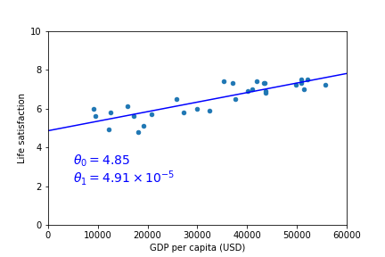
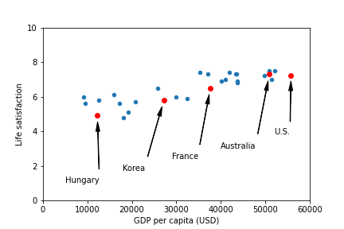
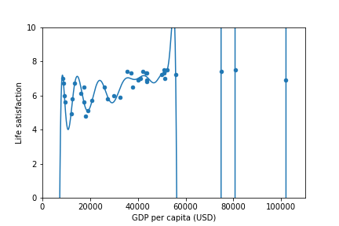
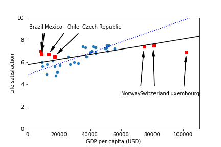

<p>

</p>


# Machine Learning Techniques

**Authors**: Ning Chen


## Overview


### Machine_Learning_Landscape











## Classification


## For More Information

Please review the full analysis in [our Jupyter Notebook]().

For any additional questions, please contact **Ning Chen—chen.ning345@gmail.com**

## Repository Structure

Description of the structure of the repository and its contents:

```
├── README.md                                     <- The top-level README for reviewers of this project
├── Machine Learning Techniques                   <- Narrative documentation for prediction in Jupyter notebook
├── data                                          <- Machine Learning Techniques data
└── images                                        <- Both sourced externally and generated from code

```
